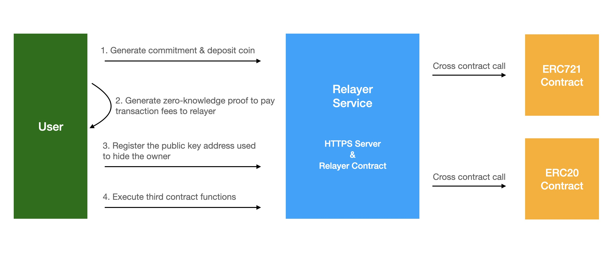

# Green Lemon Protocol

### Overview

The Green Lemon Protocol is an anonymous decentralized application platform based on zero-knowledge proof and dual-key stealth address protocol. Anyone can deploy their own anonymous smart contract and integrate it with our relayer service. Or use our template contract as well. ERC-721(NFT) is supported, and ERC-20 is under development.

Quick facts:
* Send anonymous transactions based on zero-knowledge proof
* Encrypt the asset owner based on dual-key stealth address protocol

This project is funded by the Web3 Foundation Grants Program.

* [Proposal: Dual-Key Stealth Address Protocol](https://github.com/w3f/Grants-Program/pull/997)
* [Proposal: Green Lemon Protocol🍋 - An anonymous NFT solution](https://github.com/w3f/Grants-Program/pull/1096)

### Product Logic

Green Lemon Protocol is a service like coin mixers that allows users to obfuscate the origin and destination of transactions, and submit transactions to third contracts anonymously. Because of the logic of the blockchain, every transaction is public. If you have some DOT on your account, you cannot transfer it anonymously, because anybody can follow your transaction history on the blockchain. Coin mixers, like Tornado Cash, can solve this privacy problem by breaking the on-chain link between the source and the destination address by using ZKP. Most importantly, we can trigger a third-party contract when we submit the zero-knowledge proof, and pay transaction fees to the relayer service. If the transaction fees you paid can cover the cost of calling a third-party contract. Then the whole logic makes sense.

If you want to anonymize one of your transactions, you have to deposit a small amount of DOT on the Green Lemon Protocol contract (ex.: 1 DOT). After a little while, you can transfer this 1 DOT to the account of relayer service with a different account and submit a transaction to the third contract. The trick is that nobody can create a link between the depositor account and the transferer account. If hundreds of accounts deposit 1 DOT on one side and the other hundreds of accounts transfer 1 DOT on the other side, then nobody will be able to follow the path where the transaction moves.

One of the technical challenges is that smart contract transactions are also public like any other transaction on the Polkadot network. This is the point where zero-knowledge proof will be relevant. For more details about zero-knowledge proof, please [click me](https://betterprogramming.pub/understanding-zero-knowledge-proofs-through-the-source-code-of-tornado-cash-41d335c5475f).

Another technical challenge is how to encrypt asset owners. This is the point where dual-key stealth address protocol will be relevant. For more details about DKSAP, please [click me](https://github.com/GreenLemonProtocol/dksap-polkadot).

### Work flow



The relayer contract contains 4 core functions: Deposit, RegisterPublicKeys, Withdrawal, and Execute.

* Deposit: The user deposit a coin to the NFT anonymous contract and get a note, which is used to pay the relayer fees for anonymous transactions.
* RegisterPublicKeys: The user registers the Scan public key and Spend public key to the NFT contract, so other users can query it on-chain.
* Withdrawal: The user takes back the coin previously deposited, and nullifies the corresponding note. 
* Execute: The user calls the NFT contract's function through the relayer contract.

Both `Withdrawal` and `Execute` require the user generate a zero-knowledge proof. The `Withdrawal` will send the coin back to the user. The `Execute` will transfer coin to the relayer as transaction fees.


### Install
If you are a new talent for Polkadot blockchain or Node.js, please install the DEV environment first.

* Download [substrate-greenlemon-node](https://github.com/GreenLemonProtocol/substrate-contracts-node/releases). The substrate-greenlemon-node is a new version of the substrate after increased MAXIMUM_BLOCK_WEIGHT. The default value of MAXIMUM_BLOCK_WEIGHT is too low to verify zero-knowledge proof on-chain.
* [Install Node.js environment](https://nodejs.org/en/download/)
* [Install Zokrates](https://zokrates.github.io/gettingstarted.html)
* [Install cargo-contract](https://github.com/paritytech/cargo-contract), because we need to add nightly builds to Rust runtime env & install binaryen in a version >= 99.
* Install test dependencies. `npm i -d`

### Contract build & test

Contract relayer & Contract verifier

```
cd contracts
sh ./build-all.sh
sh ./test-all.sh
```

### Test contract on-chain

#### Deploy contract to local node

#### 1. Start the local substrate node
```
./substrate-greenlemon-node --dev
```

#### 2. Deploy compiled contract `erc721` and `verifier` and `relayer` to local node by [Polkadot Portal](https://polkadot.js.org/apps/#/explorer).

contract erc721 deployment constructor param:
```
baseUri: https://raw.githubusercontent.com/GreenLemonProtocol/assets/main/nft
```

contract relayer deployment constructor param:
```
levels: 10
```

Note: Please increase the `max gas allowed` to 50000000 when trying to call a contract action by `Polkadot Portal`.

#### 3. Update contract address

* Copy `RELAYER` contract address from Polkadot Portal after contract deployed, open `http/config/default.json`, and update `RelayerContractAddress`
* Copy `ERC721` contract address from Polkadot Portal after contract deployed, open `http/config/default.json`, and update `NFTContractAddress`


#### 4. Start HTTP service
```
node http/index.js
```

#### 5. Running client test cases

```
node client/0-generateKeyPair.js
node client/1-registerScanKey.js
node client/2-mintToAlice.js
```

### Generate commitment and proof manually

#### 0. run `build.sh` to compile the circuits and setup step to generate `proving.key` and `verification.key`
```
sh ./circuits/build.sh
```

#### 1. Generate commitment

```
node scripts/1-generateCommitment.js
```

#### 2. Compute witness

```
node scripts/2-compute-witness.js
```

#### 3. Generate zero knowledge proof

```
node scripts/3-generate-proof.js
```

#### 4. Verify zero knowledge proof off-chain

```
node scripts/4-verify-proof-offchain.js
```

### Medium articles:

* [Green Lemon Protocol I — An anonymous NFT solution](https://medium.com/@wuyahuang/green-lemon-protocol-an-anonymous-nft-solution-2fad91cc8f48)
* [Green Lemon Protocol II - An anonymous NFT solution](https://medium.com/@wuyahuang/green-lemon-protocol-ii-an-anonymous-nft-solution-917046a8f1ef)

### Demo Video

* [Milestone 1](https://www.youtube.com/watch?v=etVIPgOjFNg)
* [Milestone 2](https://www.youtube.com/watch?v=2cP22UEVMF0)
